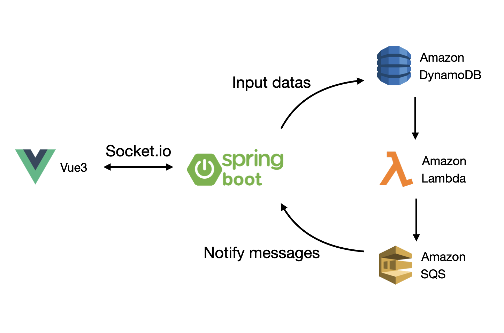

# Snow City

## Overview

This project is a dynamic web application designed to automatically update its pages upon data insertion or modification in the database. 
The primary goal was to achieve real-time updates with using RDS like AWS Aurora, but I thought it would be enough to use DynamoDB, so I don’t use RDS.

## Tech Stack

- **Frontend:** Vue 3 (Node.js 18)
- **Backend:** Spring Boot 3 (Java 17)
- **Database:** AWS DynamoDB
- **Serverless Processing:** AWS Lambda
- **Messaging Service:** AWS SQS

## Architecture

The application architecture is designed to listen for changes in the database and trigger relevant updates on the frontend. The process flow is as follows:

1. **Data insertion**: Clicking page send data to backend(Spring boot application) through Socket.io module.
2. **Database Changes:** Any insertion or modification in DynamoDB triggers AWS Lambda functions.
3. **Event Stream Processing:** AWS Lambda processes these changes and forwards the required data to AWS SQS.
4. **Frontend Updates:** The backend listens to the SQS for updates, ensuring that page content reflects the latest database state. Send this message to frontend through Socket.io.
